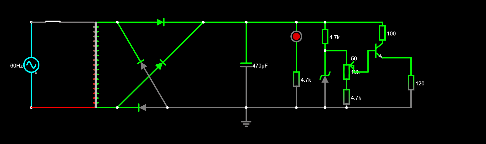
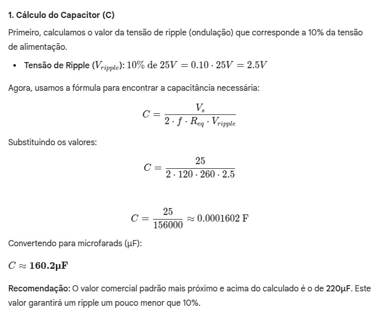
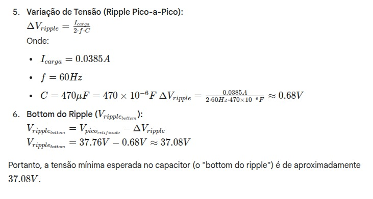

# Projeto: Fonte de Tensão Ajustável (3V a 12V - 100mA)
## 📋 Instruções
   Este projeto consiste na montagem de uma fonte de tensão ajustável capaz de fornecer uma saída entre 3V e 12V com uma corrente máxima de 100mA. O objetivo é aplicar conceitos de eletrônica analógica, como regulação linear de tensão, seleção de componentes e montagem de circuitos.
   
  Os cálculos de dimensionamento, o esquema do circuito e a lista de componentes estão descritos abaixo.

## 🧰 Tabela de Componentes Utilizados
|Quantidade|Nome do Componente |Valor Total| Modelo e Especificações                  |
|----------|-------------------|-----------|------------------------------------------|
|1 |Protoboard                 |R$21,70    |BB-01 440P S/Base Tower ++                |
|1 |Transformador	             |R$00,00    |Voltagem AC 18.1V                         |
|1	|Capacitor Eletrolítico     |R$1,50     |470µF / 25V	                             |
|1	|Potenciômetro	             |R$07,00    |B10K B16-E 10kΩ / 1W Linear               |
|10|Diodo Retificador	       |R$2,00     |1N4007	Corrente máx: 1A                   |
|2 |Diodo Zener                |R$0,80     |1N5243 13V / 1/2W                         |
|2 |Transistor                 |R$5,10     |2N2222A NPN 60V / 0,8A                    |
|10|Resistor 4K7	             |R$0,70     |CR25 4K7 4,7kΩ                            |
|10|Resistor 1K                |R$0,70     |CR25 1K 1kΩ                               |
|2 |Resistor 100R              |R$3,80     |5W 100Ω 5%                                |
|1 |LED vermelho               |R$0.20     |LED5MM                                    |

*Obs.: As peças estão contabilizadas com pelo menos 1 componente reserva*

## 📝 Descrição dos Componentes
* **Transformador:** Reduz a tensão da rede elétrica (127V AC) para 12V, adequada para a fonte.

* **Ponte Retificadora / Diodos:** Convertem a tensão AC em DC, realizando a retificação de onda completa.

* **Diodo Zener:** Ajusta a voltagem máxima como 13V para a fonte.

* **Capacitor de 470µF:** Atua como filtro, reduzindo o ripple da tensão após a retificação.

* **Potenciômetro:** Permite ajustar a tensão de saída de forma precisa.

* **Resistores 4K7:** Trabalha junto com o potenciômetro para determinar a tensão de saída.

## 📈 Circuito do Projeto
#### 📷 Imagem do Esquema Elétrico:

*Link do circuito: [Tinyurl](https://tinyurl.com/25kfmzp6).*

#### 📷 Imagem da Montagem Física (Protoboard ou PCB):

## ✏️ Cálculos Utilizados
#### Cálculo do capacitor:

*Obs.: Aumentamos o capacitor de 220uF para 470uF a fim de aumentar a voltagem do bottom do Ripple, para colocar um resistor de 1kΩ antes do Zenner*

#### Cálculo do Ripple:

## 👨‍🎓 Alunos Responsáveis
Leonardo Kenzo Tanaka [Github: [LeonardoKenzo](https://github.com/LeonardoKenzo)]

Pedro Teidi de Sa Yamacita [Github: [pedroYamacita](https://github.com/pedroYamacita)]

Gustavo de Faria Fernandes [Github: [Gustavo-Fernandes04](https://github.com/Gustavo-Fernandes04)]

Enzo Ferreira de Castro Lima
